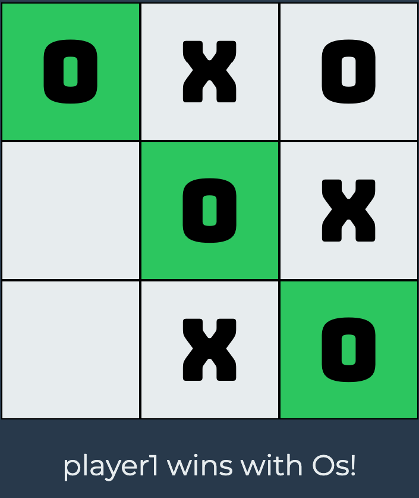

# Tic Tac Toe
Tic Tac Toe app created with HTML, CSS & Javascript for The Odin Project.

## Demo
Here is a working live demo: https://kapaha.github.io/tic-tac-toe/

## General info
This project was created as a part of the [Javascript](https://www.https://www.theodinproject.com/courses/javascript/lessons/tic-tac-toe-javascript) course with [The Odin Project](https://theodinproject.com). The aim of this project was to solidate the knowledge I have learnt about factory functions and the module pattern.

## Features
* Single player mode with difficulties: easy, medium and impossible
* AI using minimax algorithm
* Multiplayer mode - play with someone on the same computer
* Responsive design - works on mobile and tablets

## Built with
* HTML
* CSS
* Javascript

## Status
The project is finished, however I may continue to improve on it as my knowledge of web development improves.